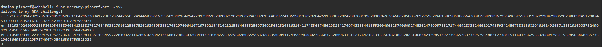

# General Skill Challenge

1.  Obedient Cat \| 5 points

> *Pretty much gives you a link to the capture the flag file. I run wget
> on the link and cat the flag file. I then copied that onto the flag
> prompt to get my points.*

2.  Wave a flag \| 10 points

*Description: Can you invoke help flags for a tool or binary? This
program has extraordinarily helpful information\...*

*Starts by providing a link to a file titled warm. I run wget on the
link and cat the warm file. It was gibberish. I then tried to ran Man
Warm because of the help hint.*

*After clicking a hit. I tried running the file. Permission was denied
so I run chmod to get me permission. Then I run the file with a -h
extension as it requests, and it gave me the file.*

3.  Let's Warm Up \| 50 points

*Description: If I told you a word started with 0x70 in hexadecimal,
what would it start with in ASCII?*

*Quick google search tells me 0x70 is P. picoctf{p} is the answer*

4.  2Warm \| 50 points

*Description: Can you convert the number 42 (base 10) to binary (base
2)?*

*Quick google search tells me 42 base ten is* 101010 in base 2

5.  Convertme.py \| 100 points

*Description: Run the Python script and convert the given number from
decimal to binary to get the flag.*

*Used 2get to get the script and run it on the python*

*It asked what 28 is in binary.*

*It's 11100. I put that in and got the flag.*

6.  PW crack 1 \| 100 points

Cat encryption \| python file. This let me look into the python file
where the password was printed in plain text.

7.  PW crack 2 \| 100 points

Repeated the same proess for PW1 except the password was written in
asciii. Employed a quick lookup table to find the answer as 4ec9

8.  PW crack 3 \| 100 points

Repeated the process of PW2 but we just get an array of passwords

The middle password was the right one

Dba8

9.  PW crack 4 \| 100 points

Run Wget to get all the appropriate files had to edit the password
checker file in order to makit it runnable through a script:

{width="6.5in"
height="3.3722222222222222in"}

Then wrote a python script to loop through the results and find the
right password

{width="6.5in"
height="1.0055555555555555in"}

After running it I got the flag

{width="6.043055555555555in"
height="9.0in"}

A better script would not stop when the password was right.

10. Mus1c \| 300 points

> Begins by downloading lyrics to a song using wget. The hint here is:
> Do you think you can master rockstar?
>
> {width="6.5in"
> height="3.154861111111111in"}
>
> Honestly have no idea where to even begin with this.
>
> It's not a real song.
>
> The song is in txt. So maybe I should cat the whole file in between
> the picoCTF curly braces. -- didn't work. Field needs 128 characters
> max
>
> Thought about encrypting it into 128 bits. But that doesn't make
> sense. Theres no secrect key I've been given by the question to ensure
> the output.
>
> Seems like the only thing to go off of is the song:
>
> {width="6.5in"
> height="6.367361111111111in"}
>
> I searched it up. Turns out this is in rockstar which is a programming
> language. running it returns ascii which converts to the word
> rrrocknrn0113r.
>
> What a dumb challenge.

# Web exploitation 

1.  Cookies \| 40 points

Challenge begins with a link that leads you to a website with a search
bar requesting cookies.

{width="6.407030839895013in"
height="3.491010498687664in"}

When you put a cookie in it responds with

{width="6.5in"
height="3.4166666666666665in"}

If you give it the right cookie you get the flag. (I had to search this
up) Apparently you can manipulate the cookie(snack in the search bar) id
that you give through playing around with the local cookie (browser
data).

{width="6.5in"
height="3.2368055555555557in"}

18 is the right cookie that returns the flag after refreshing the page.

{width="6.5in"
height="2.657638888888889in"}

2.  Super serial \| 130 points

I'm supposed to recover a flag in the page linked

{width="6.5in"
height="3.158333333333333in"}

# Cryptography

1.  Dachshund attacks \| 80 points

Not sure what the prompt is here: {width="6.5in"
height="3.1375in"}

I began by downloading the image from the hint. It's a picture of a
dog.\
After running the command nc with the link I get some weird looking
thing.

{width="6.5in"
height="0.5159722222222223in"}

I learn that this is an RSA challenge. a public key encryption method

Thought maybe the numbers were decoding keys. But none of them are prime

2.  Caesar \| 100 points

The challenge is to decrypt a message and the hint gives a tutorial

{width="6.5in"
height="3.2125in"}

I run wget to get the text and cat it

I get a flag that doesn't work picoCTF{dspttjohuifsvcjdpoabrkttds}

The hint takes me to a Caesar cipher tutorial that tells me Caesar is a
form of substitutive encryption. I don't what the key is so I'll start
by trying the tutrials suggested 3. Didn't work

I guess I can brute force this. Try each number till 26 and see which
one works. The right answer was 25

# Reverse Engineering 

1.  Transformation \| 20 points

It looks like I'm to figure out what is behind the link.

{width="6.5in"
height="3.388888888888889in"}

I run the usual wget and cat

Its in Chinese!

{width="6.5in"
height="0.6986111111111111in"}Went online to find something to decode
this with

I don't know where to start. I've tried several decoding sets none seem
to work.

2.  Hurry up! Wait! \| 100 points

I'm given an exe file to run.

This doesn't run on my pc. (pick a version that works for you computer)

I'll have to run it with windows 7 compatibility. Doesn't work

# Forensics 

1.  Glory of the Garden \| 50 points

The garden contains more than it seems:

{width="6.5in"
height="3.182638888888889in"}

The link behind garden is an image of a garden

{width="3.0526913823272093in"
height="2.286257655293088in"}

I googled the hint a hex editor lets me dit the binary data of a file.
Found the flag

{width="6.5in"
height="2.0756944444444443in"}

picoCTF{more_than_m33ts_the_3y3657BaB2C}

2.  Lookey here \| 100 points

Attackers have hidden information in a very large mass of data in the
past. I'm given a link to download the data. I'm told to download the
file and search for the flag as a hint.

{width="6.5in"
height="3.5840277777777776in"}

Run wget and grep on the file downloaded

grep \"picoCTF\" anthem.flag.txt

{width="6.5in"
height="3.5194444444444444in"}

Found the flag: picoCTF{gr3p_15\_@w3s0m3_58f5c024}

# Binary Exploitation

1.  Stonks \| 20 points

Challenge is a pseudo trading app for fake stonks.

{width="6.5in"
height="3.6222222222222222in"}

The C program seems to run a script giving you an option between buying
stonks and viewing the portfolio.

I tried opening the file to see whether I could learn something about
the API as the hint suggests.

Found a way to modify the file but not a way to modify it while it's
running on the server. So I don't know how to get the API.

2.  Clutter-Overflow \| 150 points

Cluster overflow gives me two files to download and no hints.

{width="6.5in"
height="4.538194444444445in"}

I tried running chall.c and got a permission denied. I edited the
permissions After running it I found an error in the file. So I tried
running the other file it asks me what I see:

{width="6.427083333333333in"
height="3.96875in"}
